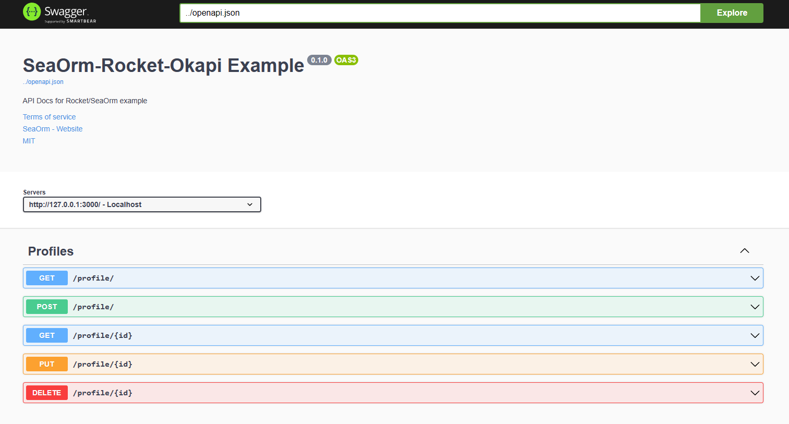
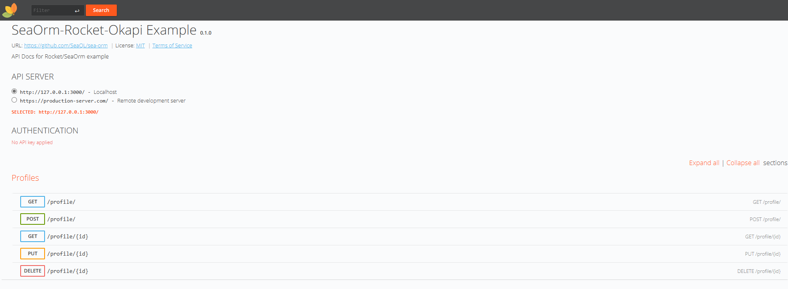

# Demo Rocket

Este repositorio contiene una aplicación de demostración escrita en Rust utilizando el framework Rocket.

## Requisitos

Antes de ejecutar esta aplicación, asegúrate de cumplir con los siguientes requisitos:

- **Rust y Cargo**: Verifica si tienes Rust instalado ejecutando `rustc --version`. Si no lo tienes, puedes obtenerlo desde [https://www.rust-lang.org/tools/install](https://www.rust-lang.org/tools/install).
- **PostgreSQL**: Esta aplicación requiere PostgreSQL como base de datos. Asegúrate de tenerlo instalado y configurado en tu sistema.
- **sea-orm-cli**: Esta aplicación utiliza sea-orm-cli para facilitar la interacción con la base de datos y la generación de código ORM. Asegúrate de tener sea-orm-cli instalado en tu sistema antes de ejecutar esta aplicación. `cargo install sea-orm-cli`

   
## Instalación

Sigue estos pasos para ejecutar la aplicación en tu entorno local:

1. Clona este repositorio: `git clone https://github.com/tu-usuario/demo-rocket.git`
2. Navega al directorio del repositorio: `cd demo-rocket`
3. Ejecuta las migraciones con el comando `sea-orm-cli migrate up`
4. Ejecuta la aplicación con Cargo: `cargo run`

## Acceso a la Documentación

Puedes acceder a la documentación de la API a través de los siguientes enlaces:

- Swagger UI: [http://localhost:{PUERTO}/swagger/](http://localhost:{PUERTO}/swagger/)
- RapiDoc: [http://localhost:{PUERTO}/rapidoc/](http://localhost:{PUERTO}/rapidoc/)

Asegúrate de reemplazar `{PUERTO}` con el número de puerto específico en el que tu aplicación está sirviendo la documentación. Por ejemplo, si estás ejecutando tu aplicación en el puerto 3000, los enlaces serían:

- Swagger UI: [http://localhost:3000/swagger/](http://localhost:3000/swagger/)

- RapiDoc: [http://localhost:3000/rapidoc/](http://localhost:3000/rapidoc/)



## Configuración del entorno

Antes de ejecutar la aplicación, asegúrate de configurar el archivo de entorno. Este repositorio incluye un archivo `.env.example` que puedes utilizar como base. Sigue estos pasos para configurar el archivo `.env`:

1. Renombra el archivo `.env.example` a `.env`.
2. Abre el archivo `.env` en un editor de texto y configura las variables de entorno según tus necesidades.

Asegúrate de no incluir información confidencial en el archivo `.env` y nunca lo compartas públicamente.

## Comandos de Cargo

A continuación se muestran algunos comandos útiles de Cargo que puedes utilizar en este proyecto:

```bash
# Compila y ejecuta la aplicación en tu entorno local
cargo run

# Compila la aplicación sin ejecutarla
cargo build

# Ejecuta las pruebas automatizadas incluidas en el proyecto
cargo test

# Genera la documentación del proyecto en formato HTML
cargo doc
```

Recuerda ejecutar estos comandos en tu terminal o línea de comandos en un entorno que tenga Rust y Cargo correctamente instalados. Asegúrate de navegar al directorio del repositorio antes de ejecutar los comandos.

## Licencia

Este proyecto está bajo la [licencia MIT](LICENSE).
